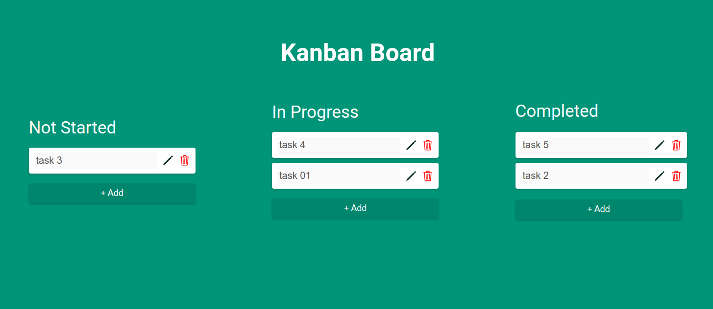
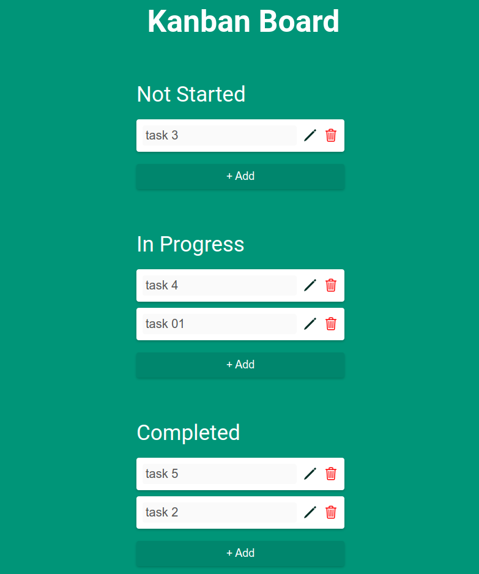

# Kanban-Board

This is a solution to the Second Stage of kalbonyan AlMarsos

## Table of contents

- [Overview](#overview)
  - [The challenge](#the-challenge)
  - [Screenshot](#screenshot)
  - [Links](#links)
- [My process](#my-process)
  - [Built with](#built-with)
  - [What I learned](#what-i-learned)

## Overview

This is a simple Kanban board project with

- Not Started
- In Progress
- Completed tasks

### The challenge

Users should be able to:

- Add new tasks
- Edit tasks
- Delete tasks
- Drag and Drop tasks to other columns

### Screenshot

. .

### Links

- Solution URL: [Solution URL](https://github.com/Mohammed-Abol-Fotouh/Kanban-Board)
- Live Site URL: [Live Site URL](https://mohammed-abol-fotouh.github.io/Kanban-Board/)

## My process

- Structure the simple page
- Style it
- Add main columns with Add buttons for every column
- Add functionality to add buttons to add new tasks
- Add functionality to edit tasks
- Add functionality to delete tasks
- Add Drag and Drop API
- Add Local storge functionality

### Built with

-HTML5

- CSS
- Flexbox
- Vanilla JavaScript
- Drag and Drop API
- Local Storage

### What I learned

This project was challenging at this time but, I learned how to implement Drag and Drop API in this project and also to set items to local strage and get them back
